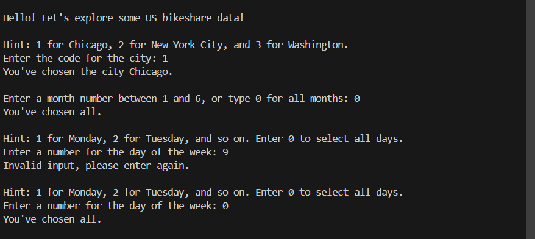
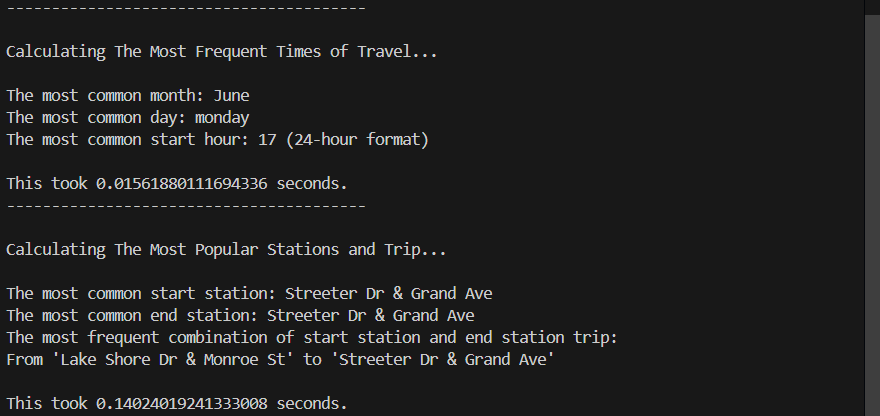
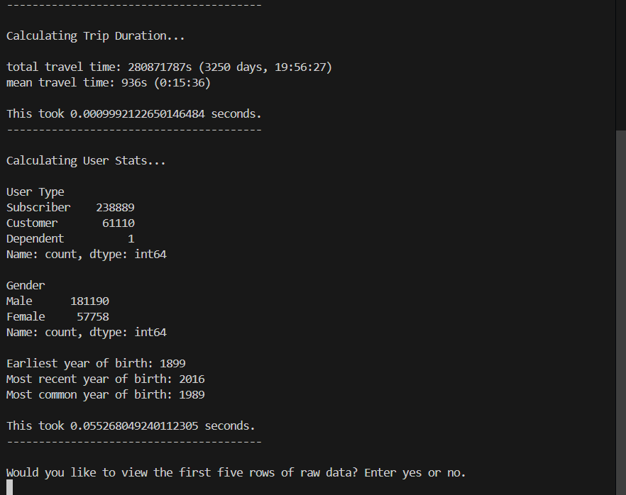

### Date created
2024-10-14

### Project Title
Explore US Bikeshare Data

### Description
A tool to view bicycle usage data by city, date, and user details using custom functions.

### Files used
* bikeshare.py: Python script for analyzing bikeshare data. It includes functions to filter, process, and summarize the data.
* *.csv: Bike-sharing usage data for different cities

### Credits
This project was inspired by udacity/ Nanodegree Program: programming for Data Science with Python.

### Usage Example

